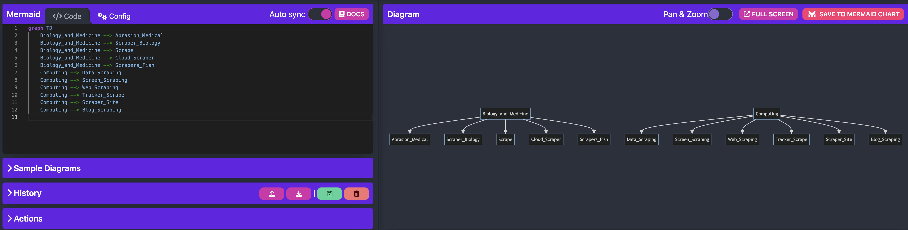

<!-- Improved compatibility of back to top link: See: https://github.com/RealAlexandreAI/sticky-hand/pull/73 -->
<a name="readme-top"></a>
<!--
*** Thanks for checking out the Best-README-Template. If you have a suggestion
*** that would make this better, please fork the repo and create a pull request
*** or simply open an issue with the tag "enhancement".
*** Don't forget to give the project a star!
*** Thanks again! Now go create something AMAZING! :D
-->


<!-- PROJECT SHIELDS -->
<!--
*** I'm using markdown "reference style" links for readability.
*** Reference links are enclosed in brackets [ ] instead of parentheses ( ).
*** See the bottom of this document for the declaration of the reference variables
*** for contributors-url, forks-url, etc. This is an optional, concise syntax you may use.
*** https://www.markdownguide.org/basic-syntax/#reference-style-links
-->
[![Contributors][contributors-shield]][contributors-url]
[![Forks][forks-shield]][forks-url]
[![Stargazers][stars-shield]][stars-url]
[![Issues][issues-shield]][issues-url]
[![GPL License][license-shield]][license-url]


<!-- PROJECT LOGO -->
<br />
<div align="center">
  <a href="https://github.com/RealAlexandreAI/sticky-hand">
    
  </a>

<h3 align="center">sticky-hand</h3>

  <p align="center">
    URL to JSON! Fetch webpage content into structured text using crawlers or AI as your want.
    <br />
    <a href="https://goplay.tools/snippet/Xr04C_wjVeB">Online Playground</a>
    ·
    <a href="https://github.com/RealAlexandreAI/sticky-hand/issues/new?labels=bug&template=bug-report---.md">Report Bug</a>
    ·
    <a href="https://github.com/RealAlexandreAI/sticky-hand/issues/new?labels=enhancement&template=feature-request---.md">Request Feature</a>
  </p>
</div>


<!-- ABOUT THE PROJECT -->
## ✋ URL to JSON! Fetch webpage content into structured text using crawlers or AI as your want.


### 🌟 Reasons to Choose sticky-hand

- 🛡️ Simplicity and Security: sticky-hand ensures ease of use and data security with its straightforward interface and robust data handling mechanisms.
- 🏗️ Structured Results: With its powerful data parsing capabilities, it can convert unstructured data into structured formats for easy processing and analysis.
- 🔩 Modular and Extensible: A modular design that allows you to flexibly add or replace data processing components based on project requirements.
- 🕷️ Traditional Web Scraping Support: Supports traditional web scraping techniques for reliably capturing the data you need.
- 🤖 AI-Assisted Summarization: Incorporates AI technology to assist in intelligent recognition and summarization of data, enhancing the accuracy and efficiency of data extraction.
- 📐 Terminal CLI Support: The feature can also be used in the command-line and can be chained with command pipes.
- 🌱 Continuous Updates: We are committed to continuously updating and improving sticky-hand, with more exciting features to come in the future.

### 🚀 Updates & Example

---

 <summary>MindMap or Mermaid summary support.</summary> 
Using the triplet structure to extract the core information of the article, a structured graphic in the form of a knowledge map
    <a href="https://github.com/RealAlexandreAI/sticky-hand">
    
  </a>

---

<details> 
 <summary>Structured Summary support, containing keywords, topic, and details.</summary>

```
{
	"summary": {
		"title": "Scrape - Identifying Various Meanings and Applications",
		"keywords": ["Scrape", "Biology", "Medicine", "Computing", "Hand tools", "Machines", "Music", "Audio", "Instruments", "Works", "Other"],
		"detailed": "The passage discusses the multiple meanings and applications of the term 'scrape.' In the field of biology and medicine, it can refer to types of injuries, such as abrasions, and various animal behaviors like grazer-scrapers and scrape nests. In computing, scraping refers to techniques like data scraping, screen scraping, and web scraping. Hand tools, such as archaeology scrapers, kitchen scrapers, and card scrapers, are also mentioned. The passage also highlights machines like the Fresno scraper and the wheel tractor-scraper. Moreover, 'scrape' is associated with music and audio, including the genre of rake and scrape and the measurement of scrape flutter. Furthermore, scrapers can be musical instruments and used in sound effects, such as pick slides. The passage lists various works, including songs titled 'Scrape' and an album called 'Scraping.' Other mentions include boot scrapers, scraper bikes, modified cars known as scrapers, scratchboard art, skyscrapers, and a place named 'Scraper.'"
	}
}
```

</details>

--- 
<details> 
 <summary>Natural Language Translation support with multi-step prompts.</summary>

```
## Thought steps:

Please think strictly in the following steps

### Literal Translation
{$LITERAL_TRANSLATION}

***

### Evaluation and Reflection
{$EVALUATION_AND_REFLECTION}

***

### Free Translation
{FREE_TRANSLATION}

```

> prompt from blogger @baoyu
</details>


<!-- GETTING STARTED -->
## 🏁 Getting Started
To add the sticky-hand to your Go project, use the following command:

```shell
go get github.com/RealAlexandreAI/sticky-hand
```

<!-- USAGE EXAMPLES -->
## Usage


```go
package main

import (
    "github.com/RealAlexandreAI/sticky-hand"
)

func main() {
	stickyhand.ScrapeURL("https://en.wikipedia.org/wiki/Scrape",
		stickyhand.WithHTML(), stickyhand.WithMarkdown(), stickyhand.WithSummary(),
		stickyhand.WithText(), stickyhand.WithTranslation("Japanese"), stickyhand.WithWebpageCapture(),
		stickyhand.WithMindMap(),
		stickyhand.WithLLMProvider("https://<llm-provider>/v1", "sk-xxxxx"))
}
```

### Output

```json
{
  "metadata": {
    "title": "Scrape",
    "siteName": "Wikimedia Foundation, Inc.",
    "length": 2868
  },
  "text": "From Wikipedia, the free encyclopedia\n\t\t\t\t\t\nScrape, scraper or scraping may refer to:\n\n\nBiology and medicine[edit]\nAbrasion (medical), a type of injury\nScraper (biology), grazer-scraper, a water animal that feeds on stones and other substrates by grazing algae, microorganism and other matter\nScrape, a depression in the ground, bare of soil, which is used as a bird nest\nCloud scraper, birds of the genus Cisticola\nscrapers, a group of cyprinid fish in the genus Capoeta\nComputing[edit]\nData scraping, a technique in which a computer program extracts data from human-readable output coming from another program\nScreen scraping, a method through which a program captures information from a display not intended for processing by computers\nWeb scraping, extracting information from a website, for analysis or reuse, most effectively by a web crawler\nTracker scrape, request sent to a BitTorrent tracker\nScraper site, a website created by web scraping\nBlog scraping, the process of scanning through a large number of blogs, searching for and copying content\nHand tools[edit]\nScraper (archaeology), a stone tool\nScraper (kitchen), a cooking tool\nCard scraper, cabinet scraper or scraper, a tool for scraping wood\nHand scraper, a single-edged tool used to scrape metal from a surface\nIce scraper, a handheld tool for removing frost, ice, and snow from windows\nPaint scraper, a hand tool to remove paint or other coatings from a substrate\nMachines[edit]\nFresno scraper, powered by an external tractor which pulls it\nWheel tractor-scraper, a piece of heavy equipment used for earth-moving\nMusic and audio[edit]\nRake and scrape, a type of Caribbean music\nScrape flutter, in sound recording, high-frequency flutter over 100 Hz\nIn instruments or implements[edit]\nScraper (instrument), a musical instrument\nPick slide, also called pick scrape, an electric guitar playing/sound effect technique\nGourd scraper, also called a pua, a stick used for playing the güiro, an instrument consisting of a hollow gourd\nIn works[edit]\n\"Scrape\" (Blue Stahli song), a 2009 non-album single by Blue Stahli\n\"Scrape\", a 2017 song by Chelsea Wolfe from Hiss Spun\n\"Scrape\", a 2017 song by Future from his self-titled album\n\"Scrape\", a 2010 song by Kurupt from Streetlights\nScraping (album), a 2002 rock music album by Calexico\nOther[edit]\nBoot scraper, an item of ironmongery used to scrape mud off boots\nScraper bike, a bicycle that has been modified by its owner\nScraper (car), a modified American-made family car characterized by large rims and extensive personalization\nScratchboard, also called a scraperboard, where drawings are created using sharp tools for etching into a thin layer of clay\nSkyscraper, a building over 40 stories tall\nSparrowhawk, Oklahoma, a census-designated place once known as \"Scraper\" in Cherokee County, Oklahoma, United States\nSee also[edit]\nScrap\nScrapie\nSkraypers",
  "html": "\u003cdiv id=\"readability-page-1\" class=\"page\"\u003e\u003cdiv\u003e\n\t\t\t\t\t\t\t\n\n\t\t\t\t\t\t\u003cp\u003eFrom Wikipedia, the free encyclopedia\u003c/p\u003e\n\t\t\t\t\t\u003c/div\u003e\u003cdiv lang=\"en\" dir=\"ltr\" id=\"mw-content-text\"\u003e\n\u003cp\u003e\u003cb\u003eScrape\u003c/b\u003e, \u003cb\u003escraper\u003c/b\u003e or \u003cb\u003escraping\u003c/b\u003e may refer to:\n\u003c/p\u003e\n\n\u003ch2\u003e\u003cspan id=\"Biology_and_medicine\"\u003eBiology and medicine\u003c/span\u003e\u003cspan\u003e\u003cspan\u003e[\u003c/span\u003e\u003ca href=\"https://en.wikipedia.org/w/index.php?title=Scrape\u0026amp;action=edit\u0026amp;section=1\" title=\"Edit section: Biology and medicine\"\u003e\u003cspan\u003eedit\u003c/span\u003e\u003c/a\u003e\u003cspan\u003e]\u003c/span\u003e\u003c/span\u003e\u003c/h2\u003e\n\u003cul\u003e\u003cli\u003e\u003ca href=\"https://en.wikipedia.org/wiki/Abrasion_(medical)\" title=\"Abrasion (medical)\"\u003eAbrasion (medical)\u003c/a\u003e, a type of injury\u003c/li\u003e\n\u003cli\u003e\u003ca href=\"https://en.wikipedia.org/wiki/Scraper_(biology)\" title=\"Scraper (biology)\"\u003eScraper (biology)\u003c/a\u003e, grazer-scraper, a water animal that feeds on stones and other substrates by \u003ca href=\"https://en.wikipedia.org/wiki/Grazing\" title=\"Grazing\"\u003egrazing\u003c/a\u003e algae, microorganism and other matter\u003c/li\u003e\n\u003cli\u003e\u003ca href=\"https://en.wikipedia.org/wiki/Scrape_nest\" title=\"Scrape nest\"\u003eScrape\u003c/a\u003e, a depression in the ground, bare of soil, which is used as a bird nest\u003c/li\u003e\n\u003cli\u003e\u003ca href=\"https://en.wikipedia.org/wiki/Cloud_scraper\" title=\"Cloud scraper\"\u003eCloud scraper\u003c/a\u003e, birds of the genus \u003ci\u003eCisticola\u003c/i\u003e\u003c/li\u003e\n\u003cli\u003escrapers, a group of cyprinid fish in the genus \u003ci\u003e\u003ca href=\"https://en.wikipedia.org/wiki/Capoeta\" title=\"Capoeta\"\u003eCapoeta\u003c/a\u003e\u003c/i\u003e\u003c/li\u003e\u003c/ul\u003e\n\u003ch2\u003e\u003cspan id=\"Computing\"\u003eComputing\u003c/span\u003e\u003cspan\u003e\u003cspan\u003e[\u003c/span\u003e\u003ca href=\"https://en.wikipedia.org/w/index.php?title=Scrape\u0026amp;action=edit\u0026amp;section=2\" title=\"Edit section: Computing\"\u003e\u003cspan\u003eedit\u003c/span\u003e\u003c/a\u003e\u003cspan\u003e]\u003c/span\u003e\u003c/span\u003e\u003c/h2\u003e\n\u003cul\u003e\u003cli\u003e\u003ca href=\"https://en.wikipedia.org/wiki/Data_scraping\" title=\"Data scraping\"\u003eData scraping\u003c/a\u003e, a technique in which a computer program extracts data from human-readable output coming from another program\n\u003cul\u003e\u003cli\u003e\u003ca href=\"https://en.wikipedia.org/wiki/Screen_scraping\" title=\"Screen scraping\"\u003eScreen scraping\u003c/a\u003e, a method through which a program captures information from a display not intended for processing by computers\u003c/li\u003e\n\u003cli\u003e\u003ca href=\"https://en.wikipedia.org/wiki/Web_scraping\" title=\"Web scraping\"\u003eWeb scraping\u003c/a\u003e, extracting information from a website, for analysis or reuse, most effectively by a web crawler\u003c/li\u003e\u003c/ul\u003e\u003c/li\u003e\n\u003cli\u003e\u003ca href=\"https://en.wikipedia.org/wiki/Tracker_scrape\" title=\"Tracker scrape\"\u003eTracker scrape\u003c/a\u003e, request sent to a BitTorrent tracker\n\u003cul\u003e\u003cli\u003e\u003ca href=\"https://en.wikipedia.org/wiki/Scraper_site\" title=\"Scraper site\"\u003eScraper site\u003c/a\u003e, a website created by web scraping\u003c/li\u003e\n\u003cli\u003e\u003ca href=\"https://en.wikipedia.org/wiki/Blog_scraping\" title=\"Blog scraping\"\u003eBlog scraping\u003c/a\u003e, the process of scanning through a large number of blogs, searching for and copying content\u003c/li\u003e\u003c/ul\u003e\u003c/li\u003e\u003c/ul\u003e\n\u003ch2\u003e\u003cspan id=\"Hand_tools\"\u003eHand tools\u003c/span\u003e\u003cspan\u003e\u003cspan\u003e[\u003c/span\u003e\u003ca href=\"https://en.wikipedia.org/w/index.php?title=Scrape\u0026amp;action=edit\u0026amp;section=3\" title=\"Edit section: Hand tools\"\u003e\u003cspan\u003eedit\u003c/span\u003e\u003c/a\u003e\u003cspan\u003e]\u003c/span\u003e\u003c/span\u003e\u003c/h2\u003e\n\u003cul\u003e\u003cli\u003e\u003ca href=\"https://en.wikipedia.org/wiki/Scraper_(archaeology)\" title=\"Scraper (archaeology)\"\u003eScraper (archaeology)\u003c/a\u003e, a stone tool\u003c/li\u003e\n\u003cli\u003e\u003ca href=\"https://en.wikipedia.org/wiki/Scraper_(kitchen)\" title=\"Scraper (kitchen)\"\u003eScraper (kitchen)\u003c/a\u003e, a cooking tool\u003c/li\u003e\n\u003cli\u003e\u003ca href=\"https://en.wikipedia.org/wiki/Card_scraper\" title=\"Card scraper\"\u003eCard scraper\u003c/a\u003e, cabinet scraper or scraper, a tool for scraping wood\u003c/li\u003e\n\u003cli\u003e\u003ca href=\"https://en.wikipedia.org/wiki/Hand_scraper\" title=\"Hand scraper\"\u003eHand scraper\u003c/a\u003e, a single-edged tool used to scrape metal from a surface\u003c/li\u003e\n\u003cli\u003e\u003ca href=\"https://en.wikipedia.org/wiki/Ice_scraper\" title=\"Ice scraper\"\u003eIce scraper\u003c/a\u003e, a handheld tool for removing frost, ice, and snow from windows\u003c/li\u003e\n\u003cli\u003e\u003ca href=\"https://en.wikipedia.org/wiki/Paint_scraper\" title=\"Paint scraper\"\u003ePaint scraper\u003c/a\u003e, a hand tool to remove paint or other coatings from a substrate\u003c/li\u003e\u003c/ul\u003e\n\u003ch2\u003e\u003cspan id=\"Machines\"\u003eMachines\u003c/span\u003e\u003cspan\u003e\u003cspan\u003e[\u003c/span\u003e\u003ca href=\"https://en.wikipedia.org/w/index.php?title=Scrape\u0026amp;action=edit\u0026amp;section=4\" title=\"Edit section: Machines\"\u003e\u003cspan\u003eedit\u003c/span\u003e\u003c/a\u003e\u003cspan\u003e]\u003c/span\u003e\u003c/span\u003e\u003c/h2\u003e\n\u003cul\u003e\u003cli\u003e\u003ca href=\"https://en.wikipedia.org/wiki/Fresno_scraper\" title=\"Fresno scraper\"\u003eFresno scraper\u003c/a\u003e, powered by an external tractor which pulls it\u003c/li\u003e\n\u003cli\u003e\u003ca href=\"https://en.wikipedia.org/wiki/Wheel_tractor-scraper\" title=\"Wheel tractor-scraper\"\u003eWheel tractor-scraper\u003c/a\u003e, a piece of heavy equipment used for earth-moving\u003c/li\u003e\u003c/ul\u003e\n\u003ch2\u003e\u003cspan id=\"Music_and_audio\"\u003eMusic and audio\u003c/span\u003e\u003cspan\u003e\u003cspan\u003e[\u003c/span\u003e\u003ca href=\"https://en.wikipedia.org/w/index.php?title=Scrape\u0026amp;action=edit\u0026amp;section=5\" title=\"Edit section: Music and audio\"\u003e\u003cspan\u003eedit\u003c/span\u003e\u003c/a\u003e\u003cspan\u003e]\u003c/span\u003e\u003c/span\u003e\u003c/h2\u003e\n\u003cul\u003e\u003cli\u003e\u003ca href=\"https://en.wikipedia.org/wiki/Rake_and_scrape\" title=\"Rake and scrape\"\u003eRake",
  "markdown": "From Wikipedia, the free encyclopedia\n\n**Scrape**, **scraper** or **scraping** may refer to:\n\n## Biology and medicine\\[ [edit](https://en.wikipedia.org/w/index.php?title=Scrape\u0026action=edit\u0026section=1 \"Edit section: Biology and medicine\")\\]\n\n- [Abrasion (medical)](https://en.wikipedia.org/wiki/Abrasion_(medical) \"Abrasion (medical)\"), a type of injury\n- [Scraper (biology)](https://en.wikipedia.org/wiki/Scraper_(biology) \"Scraper (biology)\"), grazer-scraper, a water animal that feeds on stones and other substrates by [grazing](https://en.wikipedia.org/wiki/Grazing \"Grazing\") algae, microorganism and other matter\n- [Scrape](https://en.wikipedia.org/wiki/Scrape_nest \"Scrape nest\"), a depression in the ground, bare of soil, which is used as a bird nest\n- [Cloud scraper](https://en.wikipedia.org/wiki/Cloud_scraper \"Cloud scraper\"), birds of the genus _Cisticola_\n- scrapers, a group of cyprinid fish in the genus _[Capoeta](https://en.wikipedia.org/wiki/Capoeta \"Capoeta\")_\n\n## Computing\\[ [edit](https://en.wikipedia.org/w/index.php?title=Scrape\u0026action=edit\u0026section=2 \"Edit section: Computing\")\\]\n\n- [Data scraping](https://en.wikipedia.org/wiki/Data_scraping \"Data scraping\"), a technique in which a computer program extracts data from human-readable output coming from another program\n\n  - [Screen scraping](https://en.wikipedia.org/wiki/Screen_scraping \"Screen scraping\"), a method through which a program captures information from a display not intended for processing by computers\n  - [Web scraping](https://en.wikipedia.org/wiki/Web_scraping \"Web scraping\"), extracting information from a website, for analysis or reuse, most effectively by a web crawler\n- [Tracker scrape](https://en.wikipedia.org/wiki/Tracker_scrape \"Tracker scrape\"), request sent to a BitTorrent tracker\n\n  - [Scraper site](https://en.wikipedia.org/wiki/Scraper_site \"Scraper site\"), a website created by web scraping\n  - [Blog scraping](https://en.wikipedia.org/wiki/Blog_scraping \"Blog scraping\"), the process of scanning through a large number of blogs, searching for and copying content\n\n## Hand tools\\[ [edit](https://en.wikipedia.org/w/index.php?title=Scrape\u0026action=edit\u0026section=3 \"Edit section: Hand tools\")\\]\n\n- [Scraper (archaeology)](https://en.wikipedia.org/wiki/Scraper_(archaeology) \"Scraper (archaeology)\"), a stone tool\n- [Scraper (kitchen)](https://en.wikipedia.org/wiki/Scraper_(kitchen) \"Scraper (kitchen)\"), a cooking tool\n- [Card scraper](https://en.wikipedia.org/wiki/Card_scraper \"Card scraper\"), cabinet scraper or scraper, a tool for scraping wood\n- [Hand scraper](https://en.wikipedia.org/wiki/Hand_scraper \"Hand scraper\"), a single-edged tool used to scrape metal from a surface\n- [Ice scraper](https://en.wikipedia.org/wiki/Ice_scraper \"Ice scraper\"), a handheld tool for removing frost, ice, and snow from windows\n- [Paint scraper](https://en.wikipedia.org/wiki/Paint_scraper \"Paint scraper\"), a hand tool to remove paint or other coatings from a substrate\n\n## Machines\\[ [edit](https://en.wikipedia.org/w/index.php?title=Scrape\u0026action=edit\u0026section=4 \"Edit section: Machines\")\\]\n\n- [Fresno scraper](https://en.wikipedia.org/wiki/Fresno_scraper \"Fresno scraper\"), powered by an external tractor which pulls it\n- [Wheel tractor-scraper](https://en.wikipedia.org/wiki/Wheel_tractor-scraper \"Wheel tractor-scraper\"), a piece of heavy equipment used for earth-moving\n\n## Music and audio\\[ [edit](https://en.wikipedia.org/w/index.php?title=Scrape\u0026action=edit\u0026section=5 \"Edit section: Music and audio\")\\]\n\n- [Rake and scrape](https://en.wikipedia.org/wiki/Rake_and_scrape \"Rake and scrape\"), a type of Caribbean music\n- [Scrape flutter](https://en.wikipedia.org/wiki/Wow_and_flutter_measurement#Flutter_correction \"Wow and flutter measurement\"), in sound recording, high-frequency flutter over 100 Hz\n\n### In instruments or implements\\[ [edit](https://en.wikipedia.org/w/index.php?title=Scrape\u0026action=edit\u0026section=6 \"Edit section: In instruments or implements\")\\]\n\n- [Scraper (instrument)](https://en.wikipedia.org/wiki/Scraper_(instrument) \"Scraper (instrument)\"), a musical instrument\n- [Pick slide](https://en.wikipedia.org/wiki/Pick_slide \"Pick slide\"), also called pick scrape, an electric guitar playing/sound effect technique\n- Gourd scraper, also called a pua, a stick used for playing the [güiro](https://en.wikipedia.org/wiki/G%C3%BCiro \"Güiro\"), an instrument consisting of a hollow gourd\n\n### In works\\[ [edit](https://en.wikipedia.org/w/index.php?title=Scrape\u0026action=edit\u0026section=7 \"Edit section: In works\")\\]\n\n- [\"Scrape\" (Blue Stahli song)](https://en.wikipedia.org/wiki/Scrape_(Blue_Stahli_song) \"Scrape (Blue Stahli song)\"), a 2009 non-album single by Blue Stahli\n- \"Scrape\", a 2017 song by Chelsea Wolfe from _[Hiss Spun](https://en.wikipedia.org/wiki/Hiss_Spun \"Hiss Spun\")_\n- \"Scrape\", a 2017 song by Future from his [self-titled album](https://en.wikipedia.org/wiki/Future_(Future_album) \"Future (Future album)\")\n- \"Scrape\", a 2010 song by Kurupt from _[Streetlights](https://en.wikipedia.org/wiki/Streetlights_(Kurupt_album) \"Streetlights (Kurupt album)\")_\n- [_Scraping_ (album)](https://en.wikipedia.org/wiki/Scraping_(album) \"Scraping (album)\"), a 2002 rock music album by Calexico\n\n## Other\\[ [edit](https://en.wikipedia.org/w/index.php?title=Scrape\u0026action=edit\u0026section=8 \"Edit section: Other\")\\]\n\n- [Boot scraper](https://en.wikipedia.org/wiki/Boot_scraper \"Boot scraper\"), an item of ironmongery used to scrape mud off boots\n- [Scraper bike](https://en.wikipedia.org/wiki/Scraper_bike \"Scraper bike\"), a bicycle that has been modified by its owner\n- [Scraper (car)](https://en.wikipedia.org/wiki/Scraper_(car) \"Scraper (car)\"), a modified American-made family car characterized by large rims and extensive personalization\n- [Scratchboard](https://en.wikipedia.org/wiki/Scratchboard \"Scratchboard\"), also called a scraperboard, where drawings are created using sharp tools for etching into a thin layer of clay\n- [Skyscraper](https://en.wikipedia.org/wiki/Skyscraper \"Skyscraper\"), a building over 40 stories tall\n- [Sparrowhawk, Oklahoma](https://en.wikipedia.org/wiki/Sparrowhawk,_Oklahoma \"Sparrowhawk, Oklahoma\"), a census-designated place once known as \"Scraper\" in Cherokee County, Oklahoma, United States\n\n## See also\\[ [edit](https://en.wikipedia.org/w/index.php?title=Scrape\u0026action=edit\u0026section=9 \"Edit section: See also\")\\]\n\n- [Scrap](https://en.wikipedia.org/wiki/Scrap \"Scrap\")\n- [Scrapie](https://en.wikipedia.org/wiki/Scrapie \"Scrapie\")\n- [Skraypers](https://en.wikipedia.org/wiki/Skraypers \"Skraypers\")",
  "capture": "iVBORw0KGgoAAAANSUhEUgAABkAAAASwCAYAAAC...",
  "translation": "スクレイパー（スクレーパー、英語：scraper）は、物質の外面（または外面に付着しているもの、堆積しているもの）を削ったり、こそげとる刃状、へら状の器具を言う。小さなものでは20cmほどの手動で扱うものから、大きなものでは大型の車両に数mのへら状の装置が装着されている建設機械まですべてスクレイパーと称される。小さなものは英語の clean からケレンと呼ばれることもある。",
  "summary": {
    "title": "Scrape - Identifying Various Meanings and Applications",
    "keywords": [
      "Scrape",
      "Biology",
      "Medicine",
      "Computing"
    ],
    "detailed": "The passage discusses the multiple meanings and applications of the term 'scrape.' In the field of biology and medicine, it can refer to types of injuries, such as abrasions, and various animal behaviors like grazer-scrapers and scrape nests. In computing, scraping refers to techniques like data scraping, screen scraping, and web scraping. Hand tools, such as archaeology scrapers, kitchen scrapers, and card scrapers, are also mentioned. The passage also highlights machines like the Fresno scraper and the wheel tractor-scraper. Moreover, 'scrape' is associated with music and audio, including the genre of rake and scrape and the measurement of scrape flutter. Furthermore, scrapers can be musical instruments and used in sound effects, such as pick slides. The passage lists various works, including songs titled 'Scrape' and an album called 'Scraping.' Other mentions include boot scrapers, scraper bikes, modified cars known as scrapers, scratchboard art, skyscrapers, and a place named 'Scraper.'"
  },
  "mindmap": "graph TD;A[“Biology and Medicine”]—B[“Abrasion (medical)”];A—C[“Scraper (biology)”];A—D[“Scrape”];A—E[“Cloud Scraper”];A—F[“scrapers”];G[“Computing”]—H[“Data scraping”];G—I[“Screen scraping”];G—J[“Web scraping”];G—K[“Tracker scrape”];G—L[“Scraper site”];G—M[“Blog scraping”];N[“Hand tools”]—O[“Scraper (archaeology)”];N—P[“Scraper (kitchen)”];N—Q[“Card scraper”];N—R[“Hand scraper”];N—S[“Ice scraper”];N—T[“Paint scraper”];U[“Machines”]—V[“Fresno scraper”];U—W[“Wheel tractor-scraper”];X[“Music and Audio”]—Y[“Rake and scrape”];X—Z[“Scrape flutter”];AA[“In instruments or implements”]—AB[“Scraper (instrument)”];AA—AC[“Pick slide”];AA—AD[“Gourd scraper”];AE[“In works”]—AF[“‘Scrape’ (Blue Stahli song)”];AE—AG[“‘Scrape’ (Chelsea Wolfe song)”];AE—AH[“‘Scrape’ (Future song)”];AE—AI[“‘Scrape’ (Kurupt song)”];AE—AJ[“Scraping (album)”];AK[“Other”]—AL[“Boot scraper”];AK—AM[“Scraper bike”];AK—AN[“Scraper (car)”];AK—AO[“Scratchboard”];AK—AP[“Skyscraper”];AK—AQ[“Sparrowhawk, Oklahoma”]"
}

```

### Parameter

Here's a brief description of each function:

1. `WithText()`: Sets the text field of StickyHand to true, likely indicating the scraping of plain text content.

2. `WithMarkdown()`: Sets the markdown field of StickyHand to true, likely indicating the scraping of content in Markdown format.

3. `WithHTML()`: Sets the html field of StickyHand to true, likely indicating the scraping of HTML content.

4. `WithWebpageCapture()`: Sets the capture field of StickyHand to true, likely indicating the capture of a webpage screenshot or full capture.

5. `WithSummary()`: (LLM Required) Sets the summary field of StickyHand to true, likely indicating the need for a content summary.

6. `WithTranslation(language string)`: (LLM Required) Takes a string parameter in and sets the translation field of StickyHand, likely specifying the target language for translation.

7. `WithLLMProvider(endpoint string, apiKey string)`: Takes two string parameters endpoint and apiKey, sets the llmEndpoint and llmAPIKey fields of StickyHand, and configures an openai client, likely for interaction with a Large Language Model (LLM).

8. `WithTimeout(timeout int)`:  Configuration of Context.WithTimeout().

9. `WithMindMap()`: (LLM Required) Using the triplet structure to extract the core information of the article, a structured graphic in the form of a knowledge map.


_For more examples, please refer to the [Test Cases](https://github.com/RealAlexandreAI/sticky-hand/blob/master/main_test.go) Or <a href="https://goplay.tools/snippet/Xr04C_wjVeB">Online Playground</a>_

<p align="right">(<a href="#readme-top">back to top</a>)</p>

## Terminal CLI


```bash

brew install realalexandreai/tap-stickyhand/stickyhand

stickyhand -text -markdown -html -capture -summary -mindmap -translation=Japanese -with-llm-apikey="sk-xxxxx"

```

_You can also download binary from Release, please refer to the [Releases](https://github.com/RealAlexandreAI/sticky-hand/releases)._


<!-- ROADMAP -->
## Roadmap

- [x] Basic feature 
- [x] Webpage Screenshotting
- [x] Summarization
- [x] Translation
- [x] Mindmap or Mermaid
- [ ] Add Struct Output option, not only string
- [ ] Parallelism from `katana`
- [ ] Headless browser for complex scenario
- [ ] Search API from Search2ai、Apify、Crawlbase or ArchiveBox
- [ ] Proxy & fingerprints
- [ ] Token Usage from tiktoken-go offline
- [ ] Refer to more mature web crawlers, such as Playwright and crawl4ai

See the [open issues](https://github.com/RealAlexandreAI/sticky-hand/issues) for a full list of proposed features (and known issues).

<p align="right">(<a href="#readme-top">back to top</a>)</p>


<!-- CONTRIBUTING -->
## Contributing

Contributions are what make the open source community such an amazing place to learn, inspire, and create. Any contributions you make are **greatly appreciated**.

If you have a suggestion that would make this better, please fork the repo and create a pull request. You can also simply open an issue with the tag "enhancement".
Don't forget to give the project a star! Thanks again!

1. Fork the Project
2. Create your Feature Branch (`git checkout -b feature/AmazingFeature`)
3. Commit your Changes (`git commit -m 'Add some AmazingFeature'`)
4. Push to the Branch (`git push origin feature/AmazingFeature`)
5. Open a Pull Request

<p align="right">(<a href="#readme-top">back to top</a>)</p>

<!-- LICENSE -->
## License

Distributed under the GPLv3 License. See `LICENSE` for more information.

<p align="right">(<a href="#readme-top">back to top</a>)</p>


<!-- CONTACT -->
## Contact

RealAlexandreAI - [@RealAlexandreAI](https://twitter.com/RealAlexandreAI)

Project Link: [https://github.com/RealAlexandreAI/sticky-hand](https://github.com/RealAlexandreAI/sticky-hand)

<p align="right">(<a href="#readme-top">back to top</a>)</p>


<!-- MARKDOWN LINKS & IMAGES -->
<!-- https://www.markdownguide.org/basic-syntax/#reference-style-links -->
[contributors-shield]: https://img.shields.io/github/contributors/RealAlexandreAI/sticky-hand.svg?style=for-the-badge
[contributors-url]: https://github.com/RealAlexandreAI/sticky-hand/graphs/contributors
[forks-shield]: https://img.shields.io/github/forks/RealAlexandreAI/sticky-hand.svg?style=for-the-badge
[forks-url]: https://github.com/RealAlexandreAI/sticky-hand/network/members
[stars-shield]: https://img.shields.io/github/stars/RealAlexandreAI/sticky-hand.svg?style=for-the-badge
[stars-url]: https://github.com/RealAlexandreAI/sticky-hand/stargazers
[issues-shield]: https://img.shields.io/github/issues/RealAlexandreAI/sticky-hand.svg?style=for-the-badge
[issues-url]: https://github.com/RealAlexandreAI/sticky-hand/issues
[license-shield]: https://img.shields.io/github/license/RealAlexandreAI/sticky-hand.svg?style=for-the-badge
[license-url]: https://github.com/RealAlexandreAI/sticky-hand/blob/master/LICENSE
[product-screenshot]: images/screenshot.png
